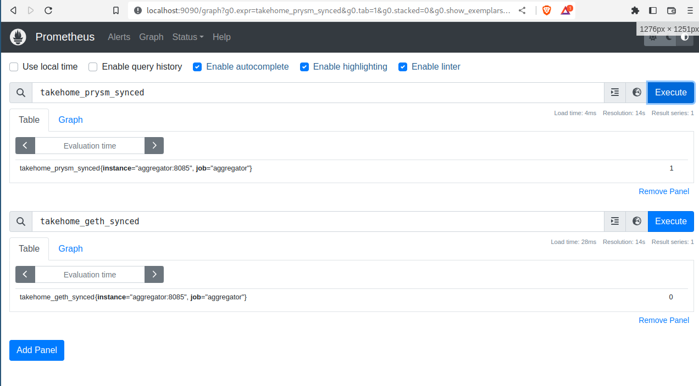

## Ether-fi takehome

### Overview
Runs a Goerli Testnet beacon and execution node alongside a prometheus stats server that reports if the nodes are synced

    // compose file for geth/prysma/prometheus/stats_aggregator
    docker-compose.yaml

    // checkpoint state for fast sync with goerli testnet
    ./init/

    // simple stats aggregator shim to export "is_synced" prometheus stats
    ./aggregator/

### Prereqs

    * generate a new JWT and save it as jwt.hex
    or use the provided insecure key
    * mv bad-jwt.hex jwt.hex

### Running

    docker-compose up --build

### Validation

    * connect to the prometheus ui instance at localhost:9090
    * inspect `takehome_prysm_synced` exported metric
    * inspect `takehome_geth_synced` exported metric

    With the provided checkpoints prysm beacon-chain should be synced within 10 minutes.
    Geth execution-client takes significantly longer

### Acknowledgements

    * Everything is more open (security-wise) than it should be to not spend too much time on this
    * only supports testnet + most configuration is hardcoded
